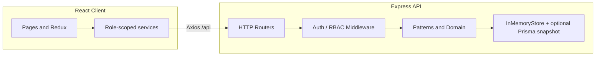

# Alma EdTech LMS

A **modular Learning Management System** capstone: role-separated experiences for **students**, **instructors**, and **administrators**, with a **layered Express API**, **React (Vite)** client, and explicit **SOLID** + **design-pattern** structure for maintainability and assessment.

[](https://nodejs.org/)
[](https://www.typescriptlang.org/)
[](https://react.dev/)
[](https://www.prisma.io/)

---

## Table of contents

- [Overview](#overview)
- [Features](#features)
- [Architecture](#architecture)
- [Tech stack](#tech-stack)
- [Getting started](#getting-started)
- [Environment variables](#environment-variables)
- [Scripts](#scripts)
- [API surface](#api-surface)
- [Repository layout](#repository-layout)
- [Design documentation](#design-documentation)
- [Testing](#testing)
- [Persistence model](#persistence-model)
- [Deploy frontend (Vercel)](#deploy-frontend-vercel)
- [Deploy backend (Azure App Service)](#deploy-backend-azure-app-service)
- [Security notes (demo)](#security-notes-demo)

---

## Overview

This project models a real-world **EdTech platform**: catalog and enrollment for learners, course authoring and grading for faculty, and user governance plus reports for operators. The codebase is organized to demonstrate **encapsulation**, **abstraction**, **polymorphism** (role profiles), **SOLID**, and **six or more GoF-style patterns** with traceable file locations and phase documentation under `docs/capstone/`.

---

## Features

| Area | Highlights |
|------|------------|
| **Authentication** | JWT login; student/instructor **self-registration** with **admin approval**; bootstrap admin account (env-overridable). |
| **Students** | Course catalog, enrollment, assignment list, submission flow with guarded lifecycle (**State** pattern on the API). |
| **Instructors** | Course CRUD with **Builder**; subjects (built-in `lms-subj-*` + custom); assignments queue; **Strategy**-based grading (numeric / rubric); teaching summary for reports. |
| **Admins** | User directory, approve/reject, activity log, exportable summary (**Bridge** pattern), platform stats. |
| **Cross-cutting** | Role middleware, **Decorator**-based RBAC demo, **Observer**-style domain events for notifications, request logging. |

---

## Architecture

High level: **React SPA** talks to **REST JSON API** under `/api/v1`. Development can run the API **inside Vite** (same origin) or as a **standalone Node** process with **Prisma-backed** snapshot persistence.



---

## Tech stack

| Layer | Choices |
|-------|---------|
| **UI** | React 19, React Router 7, Redux Toolkit, Tailwind CSS, Vite 6 |
| **API** | Express 4, `jsonwebtoken`, CORS |
| **Data** | Prisma 5 + SQLite (path from **`DATABASE_URL`**, default `file:./prisma/dev.db`); runtime graph serialized to **`AppStateSnapshot`** when using standalone `server.js` |
| **Quality** | TypeScript, ESLint, Vitest |

---

## Getting started

### Prerequisites

- **Node.js** ≥ 18  
- **npm** (ships with Node)

### Install

```bash
git clone https://github.com/balvindersingh07/EdTech-Learning-Management-System.git
cd EdTech-Learning-Management-System
npm install
```

### Database (first run)

Ensure **`.env`** includes `DATABASE_URL` (see `.env.example`), then:

```bash
npm run db:generate
npm run db:migrate
```

### Run the app (recommended for local demo)

```bash
npm run dev
```

Opens the Vite dev server (default **http://localhost:5173**). The API is mounted at **`/api`** by the Vite dev plugin so the SPA and backend share one origin.

### Run API and web on separate ports

```bash
npm run dev:stack
```

Uses **concurrently** to run Vite and `node backend/src/server.js` together. Point `VITE_API_URL` at the API origin if you split hosts (see `.env.example`).

---

## Environment variables

Copy `.env.example` to `.env` and adjust. Common entries:

| Variable | Used by | Purpose |
|----------|---------|---------|
| `ADMIN_EMAIL` | Node API | Override bootstrap admin email |
| `ADMIN_PASSWORD` | Node API | Override bootstrap admin password |
| `JWT_SECRET` | Node API | JWT signing secret (change for any shared environment) |
| `DATABASE_URL` | Prisma / API | SQLite connection string, e.g. `file:./prisma/dev.db` (required for `db:migrate` and Azure) |
| `VITE_API_URL` | Vite | API base URL (default `/api` for embedded API) |
| `PORT` | Standalone API | Listen port (default `4000`; Azure sets `PORT` automatically) |

---

## Scripts

| Command | Description |
|---------|-------------|
| `npm run dev` | Vite + embedded Express API at `/api` |
| `npm run dev:web` | Frontend only |
| `npm run dev:api` | Standalone Express API with Prisma snapshot persistence |
| `npm run dev:stack` | Vite + standalone API via `concurrently` |
| `npm run build` | `tsc --noEmit` then production Vite build → `dist/` |
| `npm run preview` | Preview production build locally |
| `npm test` | Vitest — unit + HTTP smoke tests |
| `npm run lint` | ESLint |
| `npm run db:generate` | Generate Prisma Client |
| `npm run db:migrate` | Apply migrations (dev) |
| `npm run db:push` | Push schema (prototyping; prefer migrate for teams) |
| `npm run db:studio` | Prisma Studio GUI |
| `npm start` | **`node backend/src/server.js`** — runs best-effort `prisma migrate deploy` inside the process (failures are logged; API still starts). Azure / PaaS default. |
| `npm run start:with-migrate` | Strict **`prisma migrate deploy`** then server (CI or when you want a hard fail on migrate) |

---

## API surface

Base path: **`/api/v1`**

| Prefix | Audience | Examples |
|--------|----------|----------|
| `/auth` | Public | `POST /login`, `POST /signup` |
| `/catalog` | Public | `GET /subjects` |
| `/notifications` | Authenticated | `GET /notifications` |
| `/student` | Student JWT | Catalog, enroll, assignments, submit |
| `/instructor` | Instructor JWT | Courses, subjects, assignments, grading, reports summary |
| `/admin` | Admin JWT | Users, approve/reject, activity, stats, HTML/JSON reports |

Full behavior is documented in `docs/capstone/PHASE1_DOMAIN.md` (requirements) and implemented under `backend/src/interfaces/http/`.

---

## Repository layout

```
├── backend/src/           # Express app, routes, middleware, domain, infrastructure
│   ├── application/       # Ports (e.g. CourseRepositoryPort)
│   ├── domain/            # Entities / profiles
│   ├── infrastructure/    # Store, seed, Prisma-related bootstrap
│   ├── interfaces/http/ # Routers + middleware
│   └── patterns/          # Singleton, Factory, Builder, Adapter, Bridge, Decorators, Observer, Strategy, State
├── backend/tests/         # Vitest tests
├── docs/capstone/         # Phase 1–6 + submission / evaluation guide
├── prisma/                # Schema, migrations, SQLite file (gitignored if local only — see .gitignore)
├── src/                   # React app (pages, components, store, services)
└── package.json
```

**Rubric “users/, courses/, …” folders:** the repo uses **layered folders** instead of literal top-level `users/` directories. Mapping from capstone rubric to paths is in **`docs/capstone/SUBMISSION_EVALUATION_GUIDE.md`** and summarized in the table below.

| Conceptual module | Primary locations |
|-------------------|-------------------|
| Users & auth | `interfaces/http/authController.js`, `middleware/`, `domain/entities/*Profile.js`, `patterns/factory/UserFactory.js` |
| Courses | `patterns/builder/CourseBuilder.js`, `infrastructure/CourseRepository.js`, student/instructor routes |
| Grading | `patterns/strategy/GradingStrategy.js`, instructor grade endpoints |
| Notifications | `patterns/observer/DomainEvents.js`, `patterns/adapter/LegacyEmailAdapter.js` |
| Tests | `backend/tests/` |

---

## Design documentation

| Document | Content |
|----------|---------|
| [`docs/capstone/PHASE1_DOMAIN.md`](docs/capstone/PHASE1_DOMAIN.md) | User stories, functional requirements, UML (Mermaid) |
| [`docs/capstone/PHASE2_SOLID_COURSE_MODULE.md`](docs/capstone/PHASE2_SOLID_COURSE_MODULE.md) | SOLID on course module |
| [`docs/capstone/PHASE3_PATTERNS.md`](docs/capstone/PHASE3_PATTERNS.md) | Pattern catalog and file map |
| [`docs/capstone/PHASE4_ARCHITECTURE.md`](docs/capstone/PHASE4_ARCHITECTURE.md) | Layered architecture, caching, concurrency |
| [`docs/capstone/PHASE5_REFACTORING.md`](docs/capstone/PHASE5_REFACTORING.md) | Anti-patterns and refactors |
| [`docs/capstone/PHASE6_TESTING.md`](docs/capstone/PHASE6_TESTING.md) | Tests, observability, packaging, persistence |
| [`docs/capstone/SUBMISSION_EVALUATION_GUIDE.md`](docs/capstone/SUBMISSION_EVALUATION_GUIDE.md) | Rubric alignment, video outline, pattern–problem table |

---

## Testing

```bash
npm test
```

- **Unit:** grading strategies (`backend/tests/gradingStrategy.test.js`) — no Express boot.
- **Smoke:** HTTP checks against `createLmsApp()` (`backend/tests/api.smoke.test.js`) — health, catalog, admin login, stats.

---

## Persistence model

| Mode | Behavior |
|------|----------|
| **`npm run dev`** (Vite) | In-memory seed for fast iteration; state resets when the dev server restarts. |
| **`npm run dev:api`** (`server.js`) | After each successful `store.withWrite`, the **entire LMS graph** is serialized to SQLite table **`AppStateSnapshot`** (single row). Survives API process restarts. Requires **`DATABASE_URL`** (e.g. `file:./prisma/dev.db`). |

Details: [`docs/capstone/PHASE6_TESTING.md`](docs/capstone/PHASE6_TESTING.md).

---

## Deploy frontend (Vercel)

1. In [Vercel](https://vercel.com) → **Add New Project** → import this GitHub repo.
2. **Root Directory** `./`, **Framework Preset** Vite (auto). Build: `npm run build`, output: `dist` (defaults).
3. **Environment variables** (required for a working site): set **`VITE_API_URL`** to your **hosted Express API** base path ending in `/api`, for example `https://<your-app>.azurewebsites.net/api` or `https://your-service.onrender.com/api`. The UI calls paths like `/v1/auth/login` under that base (full URLs become `.../api/v1/...`). Deploy the backend separately; Vercel does not run `backend/src/server.js` with this setup.
4. `vercel.json` adds a SPA fallback so React Router deep links (e.g. `/app/student/...`) resolve after refresh.

---

## Deploy backend (Azure App Service)

Target: **Linux** Web App, **Node 20 LTS**, deploy **this same repo** (monorepo). The API listens on **`process.env.PORT`** and serves routes under **`/api/v1`**.

### 1. Create the Web App

1. [Azure Portal](https://portal.azure.com) → **Create a resource** → **Web App**.
2. **Publish**: Code · **Runtime stack**: Node 20 LTS · **Operating System**: Linux.
3. **App Service Plan**: any tier that allows outbound HTTPS (Free F1 is enough for demos; cold starts apply).

### 2. Application settings (Configuration → Application settings)

Add at least:

| Name | Example value | Notes |
|------|----------------|-------|
| `DATABASE_URL` | `file:./prisma/prod.db` | SQLite file under `/home/site/wwwroot/prisma/` — persists across restarts on Linux App Service. |
| `JWT_SECRET` | long random string | Do not use the dev default in shared environments. |
| `NODE_ENV` | `production` | Recommended. |

Optional: `ADMIN_EMAIL`, `ADMIN_PASSWORD` (see `.env.example`). **`PORT`** is assigned by the platform — do not override unless you know the requirement for your SKU.

### 3. Deployment

- **Deployment Center**: connect your GitHub repo and branch **`main`**, enable **build** on the server (Oryx). The repo `npm run build` runs the frontend TypeScript check and Vite build; that is acceptable for deploys.
- **Startup command** (Configuration → General settings): leave default **`npm start`** (`node backend/src/server.js`). Migrations run inside startup and **do not** block the process from listening if they fail (check **Log stream** for `[LMS] prisma migrate deploy failed`).

First cold start may take longer while Prisma runs.

### 4. CORS + Vercel

The API uses permissive CORS for demos (`origin: true`). Point your Vercel **`VITE_API_URL`** at `https://<your-webapp-name>.azurewebsites.net/api` and redeploy the frontend.

### 5. Health check

Use **`/health`** as a lightweight probe path if you configure App Service **Health check**.

---

## Security notes (demo)

- Default JWT secret and admin password are for **local demonstration only**. **Rotate** `JWT_SECRET`, `ADMIN_PASSWORD`, and database paths before any shared or production deployment.
- CORS is permissive in development; tighten for production.
- Assignment of **admin** role via public signup is **disabled**; one bootstrap admin is seeded (overridable via env).

---

## License

Private / educational capstone project unless otherwise specified by the author.

---

## Acknowledgement

Built as a **software design & architecture capstone** emphasizing OOP, SOLID, design patterns, and layered structure over feature breadth.
