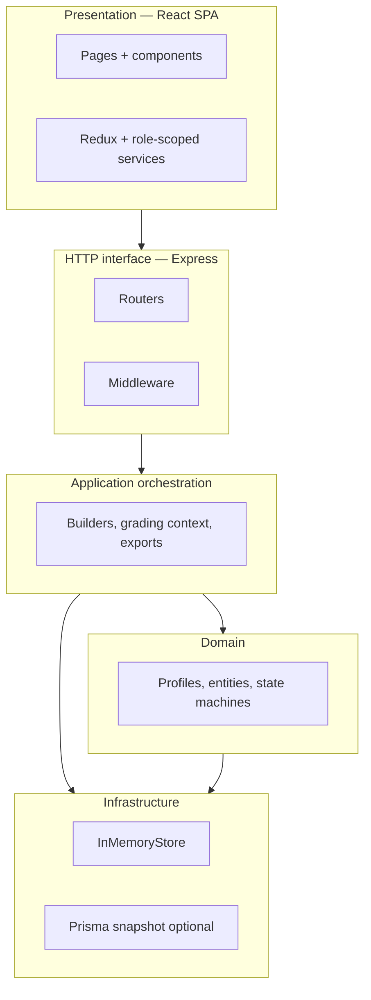

# Architecture overview

This document satisfies capstone deliverables for **layered architecture**, **MVC mapping**, **hexagonal “ports & adapters” flavor**, and notes on **scalability**, **caching**, and **concurrency**. Implementation detail: see [`docs/capstone/PHASE4_ARCHITECTURE.md`](capstone/PHASE4_ARCHITECTURE.md).

---

## 1. Layered architecture

| Layer | Responsibility | Primary locations |
|-------|------------------|-------------------|
| **Presentation** | UI, routing, client state | `src/` (React, Redux, pages) |
| **Application / interfaces** | HTTP translation, validation hooks | `backend/src/interfaces/http/` |
| **Domain** | Entities, role profiles, workflow rules | `backend/src/domain/` |
| **Infrastructure** | Persistence adapters, seed, Prisma bootstrap | `backend/src/infrastructure/` |
| **Cross-cutting** | Auth, logging, config singleton | `middleware/`, `patterns/singleton/AppConfig.js` |

---

## 2. MVC mapping (conceptual)

Strict **Model–View–Controller** is split across **client and server**:

| MVC | In this repo |
|-----|----------------|
| **Model** | Domain entities + store (`InMemoryStore`, DTOs) and Redux slices mirroring API views |
| **View** | React components under `src/pages`, `src/components` |
| **Controller** | Express routers + thin handlers (`*Routes.js`); client “controllers” are thunks/services calling Axios |

**Note:** The backend is **not** a classic server-rendered MVC stack; it is **API + SPA**. Rubric “MVC” is satisfied by **mapping** this split explicitly in documentation and viva.

---

## 3. Hexagonal (ports & adapters) flavor

| Port / abstraction | Adapters / implementations |
|----------------------|----------------------------|
| `CourseRepositoryPort` (application port) | `CourseRepository`, `CachedCourseRepository` (decorator) |
| Notification sending | `LegacyEmailAdapter` adapting a legacy-shaped API |
| Config access | `AppConfig` singleton as single source of JWT/TTL |

**Outcome:** Core logic depends on **abstractions**; concrete I/O can be swapped or decorated (cache, audit).

---

## 4. Scalability notes

- **Current:** Monolith Node process + optional SQLite snapshot persistence — appropriate for **capstone** and demos.
- **Horizontal scale:** Stateless JWT validation allows **multiple API replicas** behind a load balancer once session state stays out of memory (already true for JWT).
- **Data scale:** Snapshot JSON in SQLite is a **demo trade-off**; production would move toward **normalized relational** or **bounded context** services per rubric “microservices” option.

---

## 5. Caching

- **Pattern:** **Decorator** — `CachedCourseRepository` wraps `CourseRepository` with TTL reads.
- **Pseudo-flow:** `GET` course by id → if cache hit and fresh → return; else delegate to inner repository, store result, return.
- **Invalidation:** Documented extension on course writes (see PHASE4).

---

## 6. Concurrency (Node.js)

- Node runs **one thread** per process; overlapping **`async`** handlers can still interleave around `await`.
- **`InMemoryStore.withWrite`** chains a promise lock so **mutations serialize** in the demo process.
- **Future multi-node:** Replace with distributed lock (e.g. Redis) or optimistic concurrency (ETags).

---

## Related files

- [`docs/capstone/PHASE4_ARCHITECTURE.md`](capstone/PHASE4_ARCHITECTURE.md)
- [`docs/patterns/design-patterns.md`](patterns/design-patterns.md)
- Root [`README.md`](../README.md) — high-level diagram
