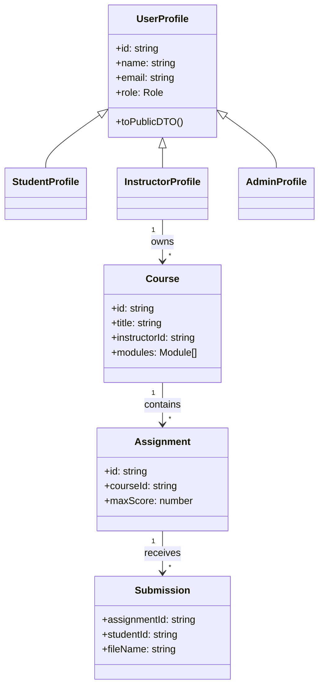

# Phase 1 — Domain and requirement modeling

## User stories (excerpt)

- **As a student**, I want to browse the public catalog, enroll in a course, and submit assignments for courses I joined so that I can complete my program without seeing instructor tools.
- **As an instructor**, I want to author and update only my own courses and grade submissions for those courses so that accountability stays scoped to my teaching domain.
- **As an admin**, I want to review users, audit activity, and export governance reports so that I can operate the platform without performing instructional workflows.

## Functional requirements

1. Authentication issues JWTs containing `sub`, `role`, and `email`.
2. Student APIs are mounted under `/api/v1/student/*` and never perform grading or admin mutations.
3. Instructor APIs are mounted under `/api/v1/instructor/*` and never mutate unrelated instructors’ courses.
4. Admin APIs are mounted under `/api/v1/admin/*` and never expose student submission endpoints.

## UML — core domain (Mermaid)

## Mapping features to OOP principles

| Principle | LMS mapping |
|-----------|-------------|
| Encapsulation | `InMemoryStore.withWrite` serializes mutations; JWT middleware hides verification details. |
| Inheritance / substitutability | `StudentProfile`, `InstructorProfile`, and `AdminProfile` share a common shape through `UserFactory`. |
| Abstraction | `CourseRepositoryPort` isolates persistence from HTTP handlers. |
| Polymorphism | `GradingContext` swaps `NumericGradingStrategy` vs `RubricGradingStrategy` without changing controller structure. |
