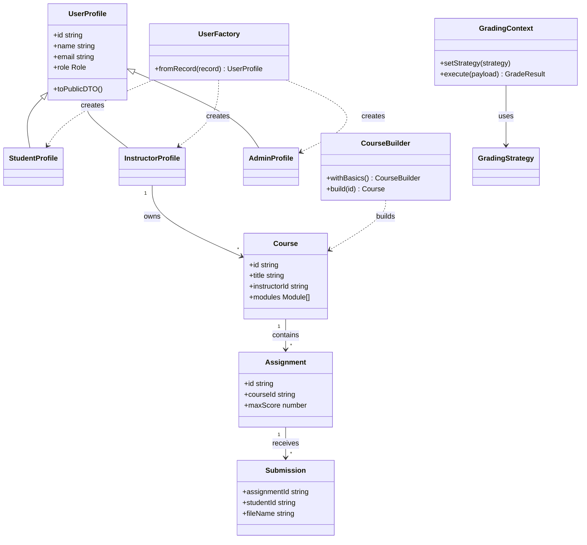

# UML — Class diagram (submission)

This diagram extends the domain view in [`docs/capstone/PHASE1_DOMAIN.md`](../capstone/PHASE1_DOMAIN.md) with **pattern touchpoints** (stereotypes as notes).

## How to export

1. Copy the fenced block into [mermaid.live](https://mermaid.live) or use a Mermaid-compatible Markdown preview.
2. Export **PNG/SVG** for your PDF or slides.
3. Optionally add to [`docs/screenshots/`](../screenshots/) per [`uml-proof.md`](../screenshots/uml-proof.md).
