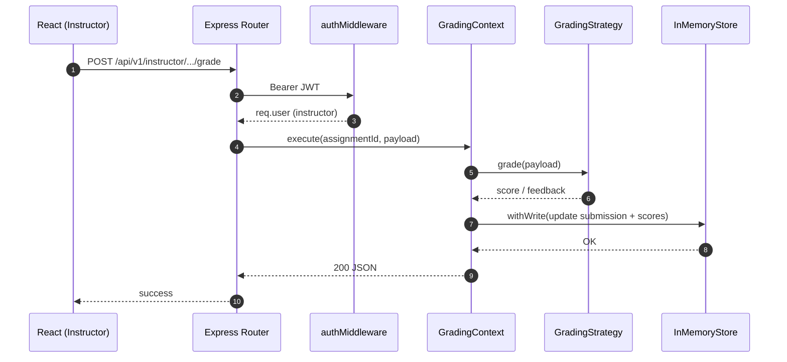

# UML — Sequence diagram (submission)

**Scenario:** Instructor submits a grade; API selects a **Strategy** (numeric vs rubric), persists via **InMemoryStore** (serialized writes), and may emit **domain events** for notifications.

## Variant: observer fan-out

After `withWrite`, the production code may notify listeners registered via **Observer**-style domain events (see `DomainEvents.js`). For brevity, that optional async fan-out is omitted here; describe it in narration during demo.

## Export

Use [`docs/screenshots/uml-proof.md`](../screenshots/uml-proof.md) for submission captures.
